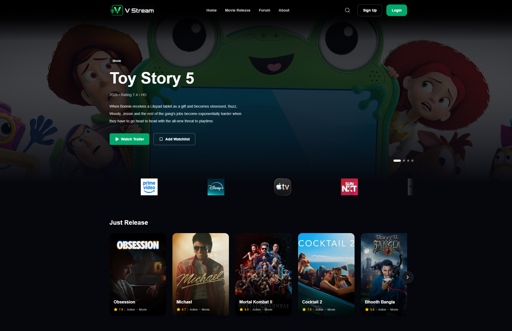
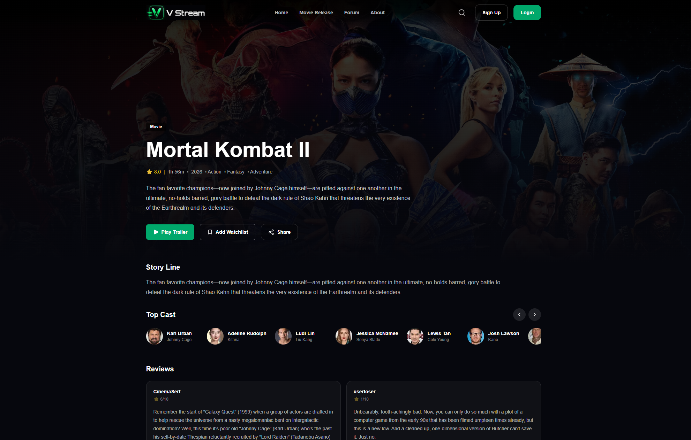
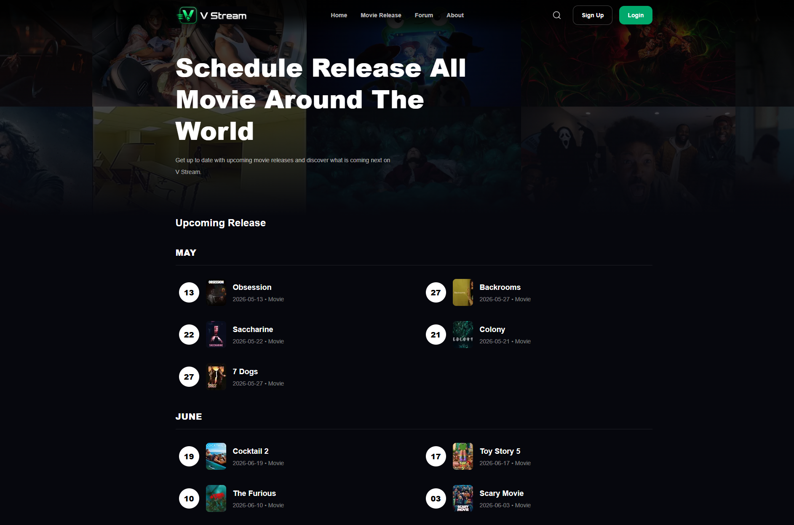
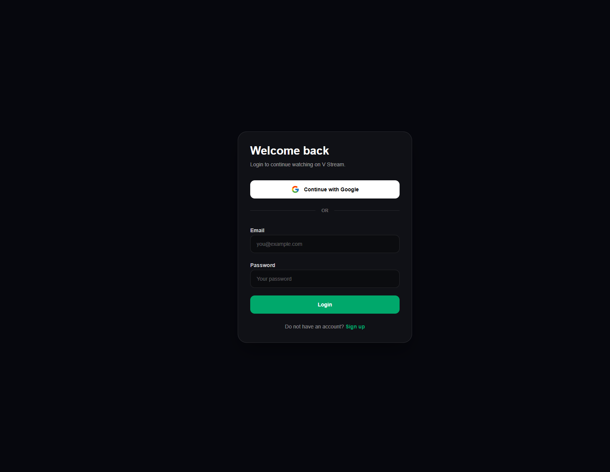

# 🎬 V Stream

A modern streaming platform concept built with **Next.js**, **TypeScript**, **Firebase**, and **TMDB API**.

V Stream is a full-stack portfolio project inspired by modern streaming services such as Netflix, Disney+, and Prime Video. The platform allows users to explore movies and TV series, watch trailers, manage personal watchlists, discover upcoming releases, and participate in community discussions.

---

## 🌐 Live Demo

🔗 **Production URL:**
[Add your Vercel deployment link here]

Example:

https://your-project.vercel.app

---

## 📸 Screenshots

### Home Page



---

### Movie Details Page



---

### Movie Release Page



---

### Authentication



---

## ✨ Features

### 🎥 Movie Discovery

* Browse trending movies and TV series
* Explore popular and upcoming releases
* View detailed movie information
* See cast information and similar recommendations

### ▶️ Trailer Playback

* Watch official trailers directly from TMDB
* YouTube trailer modal integration
* Trailer availability handling with custom UI

### 🔍 Smart Search

* Real-time movie search
* Search suggestions
* Direct navigation to movie details pages

### 🔐 Authentication

* Firebase Authentication
* Email & Password login
* Google Sign-In
* Protected user features

### ❤️ Personal Watchlist

* Add movies and series to watchlist
* Remove items from watchlist
* Persistent storage using Firestore
* Personalized homepage watchlist section

### ⭐ Reviews

* TMDB Reviews integration
* Review cards displayed on movie details pages

### 💬 Community Forum

* Hot Movie Topics
* Popular Discussions
* Movie Premiere Events

### 📅 Movie Release Calendar

* Browse upcoming movie releases
* Organized release schedule
* Direct navigation to movie details

---

## 🏗️ Tech Stack

### Frontend

* Next.js 16
* React
* TypeScript
* Tailwind CSS
* Lucide React

### Backend & Services

* Firebase Authentication
* Firestore Database
* TMDB API

### Deployment

* Vercel

---

## 📂 Project Structure

```bash
src/
│
├── app/
│   ├── about/
│   ├── forum/
│   ├── movie-release/
│   ├── details/
│   ├── login/
│   ├── register/
│   └── api/
│
├── components/
│   ├── home/
│   ├── details/
│   ├── forum/
│   ├── movieRelease/
│   ├── about/
│   ├── layout/
│   └── user/
│
├── services/
│
├── lib/
│
├── types/
│
└── context/
```

---

## 🚀 Getting Started

### Clone Repository

```bash
git clone https://github.com/your-username/v-stream.git

cd v-stream
```

### Install Dependencies

```bash
npm install
```

### Configure Environment Variables

Create a `.env.local` file in the project root:

```env
NEXT_PUBLIC_TMDB_API_KEY=YOUR_TMDB_API_KEY

NEXT_PUBLIC_FIREBASE_API_KEY=YOUR_FIREBASE_API_KEY
NEXT_PUBLIC_FIREBASE_AUTH_DOMAIN=YOUR_FIREBASE_AUTH_DOMAIN
NEXT_PUBLIC_FIREBASE_PROJECT_ID=YOUR_FIREBASE_PROJECT_ID
NEXT_PUBLIC_FIREBASE_STORAGE_BUCKET=YOUR_FIREBASE_STORAGE_BUCKET
NEXT_PUBLIC_FIREBASE_MESSAGING_SENDER_ID=YOUR_FIREBASE_MESSAGING_SENDER_ID
NEXT_PUBLIC_FIREBASE_APP_ID=YOUR_FIREBASE_APP_ID
```

### Run Development Server

```bash
npm run dev
```

Open:

```txt
http://localhost:3000
```

---

## 🔥 Firebase Setup

### Authentication

Enable:

* Email / Password
* Google Sign-In

### Firestore

Create Firestore Database and configure security rules according to your project requirements.

---

## 🎬 TMDB API

This product uses the TMDB API but is not endorsed or certified by TMDB.

https://www.themoviedb.org

---

## 📈 Future Improvements

* Favorites system
* User profile page
* Community comments
* Discussion threads
* Personalized recommendations
* Notification system
* Advanced filtering
* Dark/Light theme support

---

## 👨‍💻 Author

**Vahid Aliyev**

---

## 📄 License

This project was created for educational and portfolio purposes.
